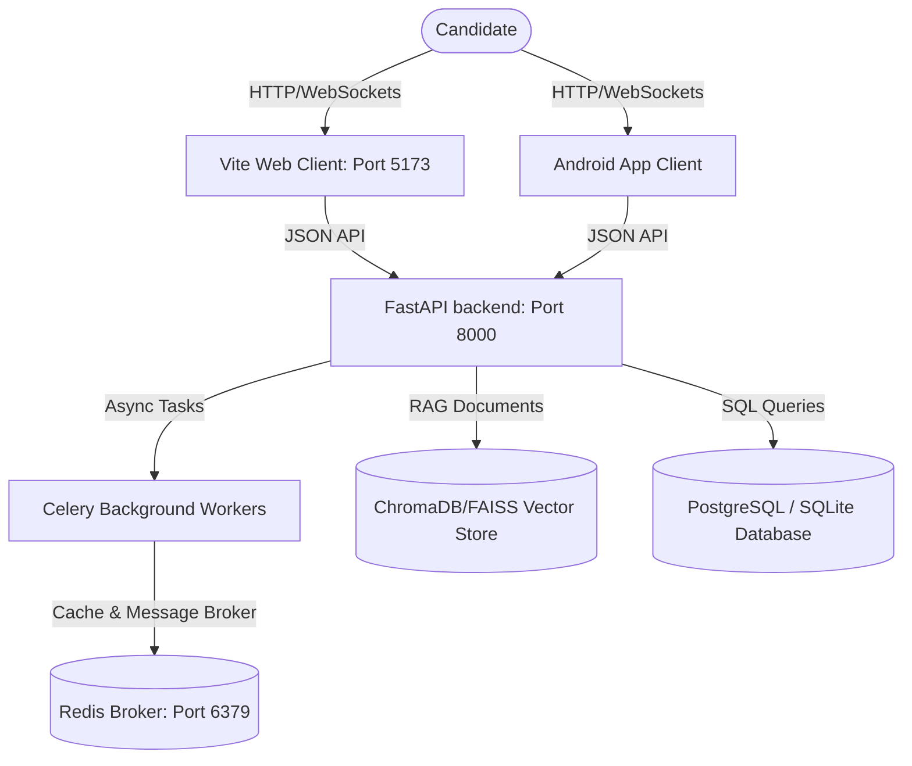

# MockAi - Smart AI-Based Mock Interview Platform

MockAi is an enterprise-grade AI-powered mock interview platform that helps candidates practice coding challenges, conceptual quizzes, text-based interviews, and real-time video-behavioral sessions (analyzing gaze, posture, expression, and pacing).

---

## 🏛 Platform Architecture



---

## 📂 Repository Structure

The codebase is organized into four self-contained modules:

| Component | Path | Tech Stack | Port | Purpose |
| :--- | :--- | :--- | :--- | :--- |
| **Backend** | [`/backend`](file:///e:/MocrAI/backend) | Python 3.12, FastAPI, SQLAlchemy 2.0 | `8000` | REST API endpoints, WebSockets, RAG, and Async Celery Tasks |
| **Web Portal** | [`/web`](file:///e:/MocrAI/web) | React 19, TypeScript, Vite, Tailwind CSS v4 | `5173` | Immersive web candidate dashboard & interview engine |
| **Android App**| [`/frontend`](file:///e:/MocrAI/frontend) | Kotlin, Jetpack Compose, XML, Hilt, Room | N/A | Mobile client for behavioral video practice and quizzes |
| **Database** | [`/database`](file:///e:/MocrAI/database) | MySQL / SQLite schema definitions | N/A | SQL migrations and core tables initialization |

---

## 🚀 Quick Start Guide

To run the entire platform locally, follow these steps sequentially:

### 1. Prerequisite Checklist
- **Redis Server**: Installed and running on `localhost:6379`.
- **Node.js**: Installed (version 18+ or 20+ recommended).
- **Python**: Installed (version 3.10 to 3.12).
- **Java JDK**: Version 17 installed (required for Android compiling).

---

### 2. Setup Database & Backend
1. **Initialize DB Schema**: Refer to the [`/database`](file:///e:/MocrAI/database/README.md) instructions.
2. **Launch Backend & Celery**:
   Navigate to the backend folder, create a virtual environment, install requirements, and run:
   ```bash
   cd backend
   python -m venv venv
   # Activate:
   .\venv\Scripts\activate      # Windows
   source venv/bin/activate    # macOS/Linux
   
   pip install -r requirements.txt
   python start.py
   ```
   *Detailed instructions are available in the [Backend README](file:///e:/MocrAI/backend/README.md).*

---

### 3. Setup Web Client
1. Navigate to the web folder:
   ```bash
   cd web
   npm install
   npm run dev
   ```
2. Open your browser and navigate to `http://localhost:5173`.
   *Detailed instructions are available in the [Web Client README](file:///e:/MocrAI/web/README.md).*

---

### 4. Build and Install Android App
1. Open the `/frontend` directory in Android Studio.
2. If your computer's local network/Wi-Fi IP changes, update the configuration:
   - Find your local network IP:
     - **Windows**: Run `ipconfig` (look for the active IPv4 Address)
     - **macOS**: Run `ipconfig getifaddr en0` (or `ifconfig | grep "inet "`)
     - **Linux**: Run `hostname -I | awk '{print $1}'`
   - Open [`gradle.properties`](file:///e:/MocrAI/frontend/gradle.properties) in the `frontend` folder.
   - Modify the `apiBaseUrl` property to point to your local IP:
     ```properties
     apiBaseUrl=http://192.168.x.x:8000/api/v1/
     ```
3. Compile and launch:
   ```bash
   cd frontend
   ./gradlew installDebug
   ```
   *Detailed instructions are available in the [Android App README](file:///e:/MocrAI/frontend/README.md).*

---

## 📞 Services & Port Allocations

- **FastAPI Core API**: `http://localhost:8000` (docs: `/docs`)
- **Vite Local Web Client**: `http://localhost:5173`
- **Redis Service Broker**: `localhost:6379`
- **ChromaDB Vector Store**: Embedded (stored locally in backend db folder)
